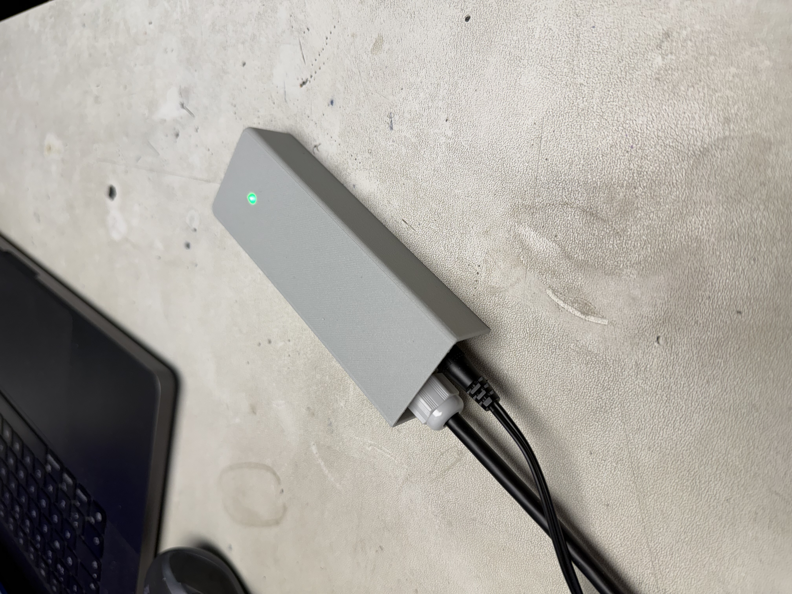
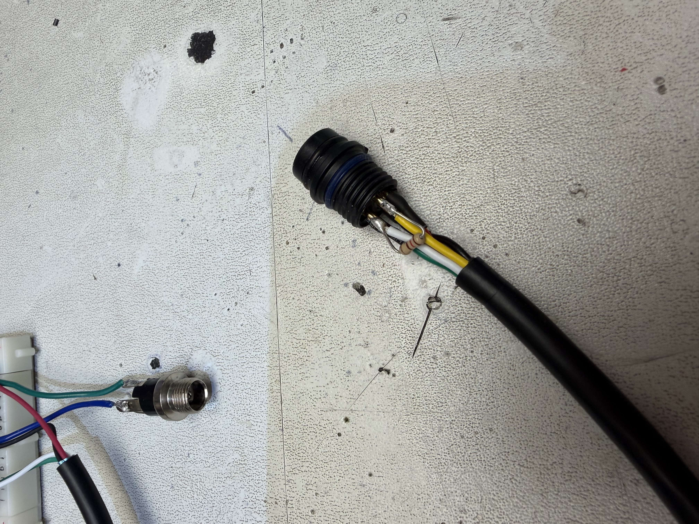
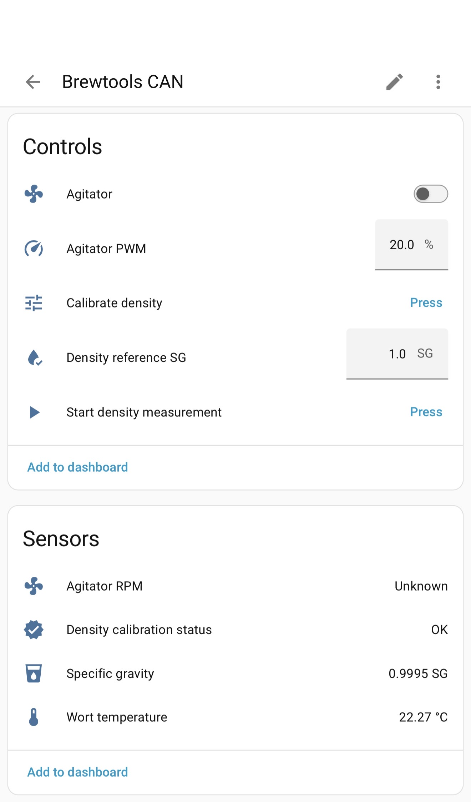
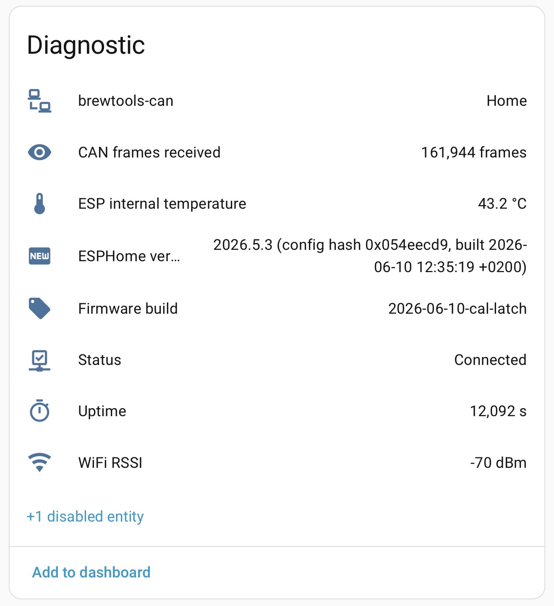
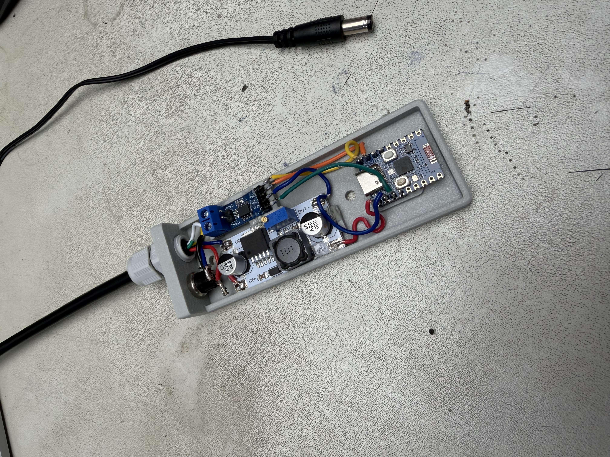
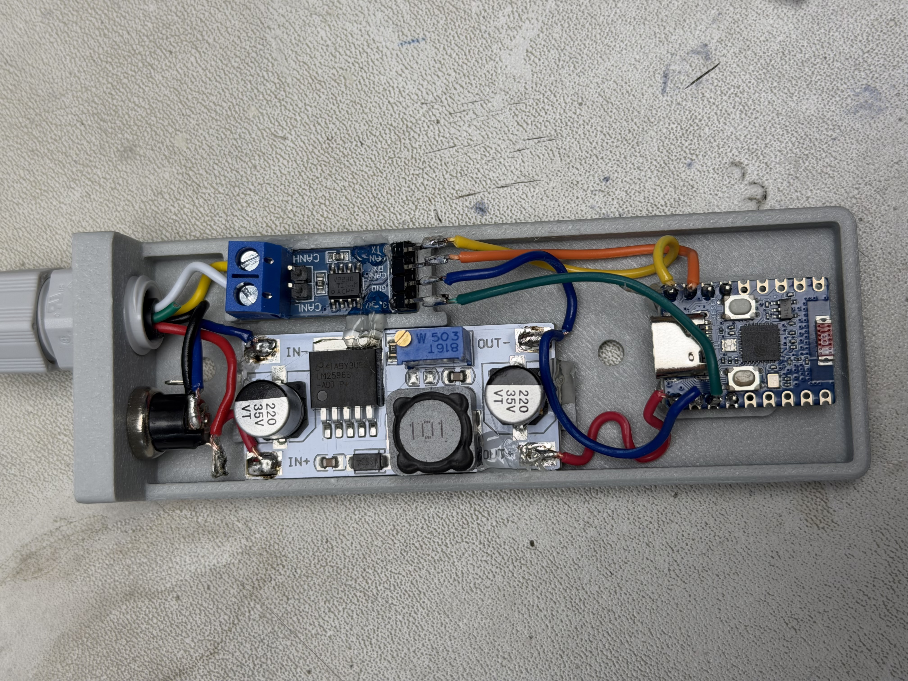
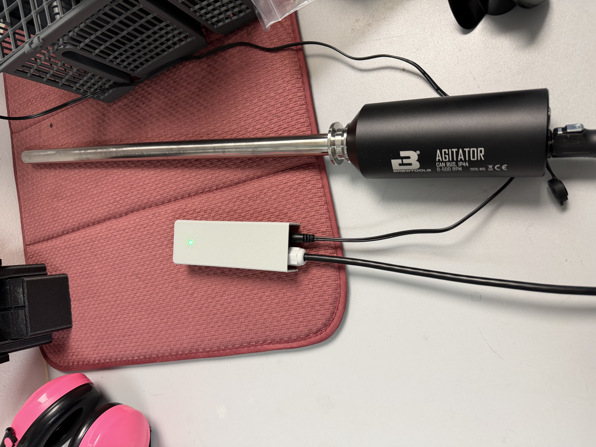

# Brewtools CAN — ESPHome controller

ESPHome firmware that bridges [Brewtools](https://brewtools.com) CAN bus devices — the
**density meter** and the **agitator** — to Home Assistant on a cheap **ESP32-C3**, using
Brewtools' native CAN protocol. It lets you read specific gravity, wort temperature and RPM,
drive the agitator, and calibrate the density meter, all from Home Assistant.

**No Brewtools FCS module is required** — this controller plus the CAN devices is the entire
setup, and the bus runs standalone. A Brewtools FCS is only needed if you want to update the
*firmware* on the nodes themselves, which isn't something done during normal operation.



> ⚠️ **Not affiliated with Brewtools.** This is a community project built from Brewtools'
> public ["CAN devices on other platforms"](https://docs.brewtools.com/sensors/can-devices-on-other-platforms)
> documentation. Talking to hardware over a third-party integration can misbehave — **use at
> your own risk**, especially the calibration and PWM commands, which write to the devices.

## Features

- 🌀 **Agitator** — on/off switch + PWM speed (0–100 %) setpoint; full state (on/off + speed)
  restored after a power loss
- 🧪 **Density meter** — specific gravity (SG) + wort temperature, a one-button calibration to a
  reference SG, and a live calibration-status readout
- 🚦 **RGB status LED** (onboard WS2812) — wifi / Home Assistant connection state at a glance
- 🩺 **Diagnostics** — uptime, RSSI, internal temperature, received-frame counter, running
  firmware build
- 💾 Survives power loss (agitator state) and OTA updates (with ESP-IDF rollback protection)

## Hardware (BOM)

| Part | Notes |
|---|---|
| ESP32-C3 | Waveshare **ESP32-C3-Zero** here (onboard WS2812 RGB on GPIO10) |
| CAN transceiver | Waveshare **SN65HVD230** board (3.3 V, onboard 120 Ω termination) |
| Buck converter | 24 V → 5 V (e.g. **LM2596** module — set it to 5.0 V *before* connecting the C3!) |
| 24 V PSU | Brewtools devices are powered from 24 V |
| LP12 connector | 5-pin, matches the Brewtools bus |
| 1× 120 Ω resistor | second bus terminator (see Wiring) |

## Wiring

```
Power:   24V+  -> buck VIN+          buck 5V OUT -> C3 5V
         24V-  -> buck VIN-/GND      buck GND    -> C3 GND
         C3 3V3 -> SN65HVD230 VCC    C3 GND      -> SN65HVD230 GND

CAN:     C3 GPIO21 (TX) -> SN65HVD230 D (CAN_TX, driver input)
         C3 GPIO20 (RX) -> SN65HVD230 R (CAN_RX, receiver output)
         SN65HVD230 CANH / CANL -> bus

LP12:    PIN1 (red)   +24V     PIN2 (yellow) CAN H
         PIN3 (white) CAN L    PIN4 (green)  NC
         PIN5 (black) GND
```

- **GPIO20/21** are used (not the default 4/5) to keep wiring away from the C3-Zero's ceramic
  antenna. Avoid GPIO18/19 — those are the native USB lines.
- **Termination:** the SN65HVD230 board's fixed 120 Ω sits at one end of the bus; add a second
  120 Ω at the far end. With power off you should measure **60 Ω** across CAN H–L.
- The Brewtools devices have no internal termination; they hang as short stubs between the two
  bus ends. Keep stubs short (<30 cm) at 1 Mbps.

The second 120 Ω terminator soldered into the far end of the bus cable:



## CAN protocol (summary)

1 Mbps, 29-bit extended IDs. ID layout:

```
priority<<27 | senderNodeType<<19 | receiverNodeType<<11 | secondaryNodeId<<8 | msgType
```

- **Node types:** PLC = 8 (this controller), density meter = 4, agitator = 6
- **Message types:** temperature = 12 (float °C), density = 14 (float SG), RPM = 17 (uint32
  big-endian), PWM = 27, calibration cmd = 28, calibration ack = 29, start-measurement = 33
- **Payload:** `data[0]` = sub-index, then the value. Floats are IEEE-754 **little-endian**.

Full reference: [Brewtools docs](https://docs.brewtools.com/sensors/can-devices-on-other-platforms).

## Setup

1. Install [ESPHome](https://esphome.io).
2. Create your secrets file and fill it in:
   ```bash
   cp secrets.yaml.example secrets.yaml
   openssl rand -base64 32      # value for bt_api_encryption_key
   ```
3. **First flash must be over USB** (`esphome run brewtools-can.yaml`, pick the serial port).
   After the first flash, OTA updates work over wifi.
4. Add the device in Home Assistant — it's auto-discovered; the API key is in your `secrets.yaml`.

## Home Assistant entities

|  |  |
|:---:|:---:|

- **Agitator** (switch), **Agitator PWM** (number, %), **Agitator RPM** (sensor)
- **Specific gravity**, **Wort temperature**
- **Density reference SG** (number), **Calibrate density** (button),
  **Start density measurement** (button), **Density calibration status**
- Diagnostics: **Uptime**, **WiFi RSSI**, **ESP internal temperature**, **CAN frames received**,
  **Firmware build**, **ESPHome version**, **Status**

## Density calibration

Single-point calibration to a known reference SG:

1. Immerse the sensor in a liquid of known SG — **distilled water = 1.0000** is the cleanest,
   most repeatable reference.
2. Set **Density reference SG** to that value.
3. Press **Calibrate density** and watch **Density calibration status** go `Calibrating → OK`.

The reference SG is persisted across reboots. Calibrate at a stable, known temperature.

## Enclosure (3D-printed case)

STEP files for the printed case are in [`cad/`](cad/) (GitHub shows them in an interactive 3D
viewer):

- [Box](cad/Brewtools%20CAN%20controller%20box.STEP)
- [Lid](cad/Brewtools%20CAN%20controller%20box%20lid.STEP)

|  |  |
|:---:|:---:|



Design notes (see also [`cad/README.md`](cad/README.md)):
- Keep the C3-Zero's ceramic antenna end clear of metal/copper.
- Add a light pipe/window over the onboard WS2812 (GPIO10) so the status LED shows through.
- For the wet brewing environment: conformal coating and/or a breather vent, and route cable
  glands downward so condensation drains away from the electronics.

## Gotchas / lessons learned

- ESPHome's bit-rate key is **`1000KBPS`**, not `1MBPS` (the latter fails validation on the C3).
- This C3-Zero's onboard LED is **`rgb_order: RGB`**, not the usual GRB (green/red were swapped).
- After an **OTA** flash, let the device run ~60 s before rebooting, or ESP-IDF's rollback
  reverts to the previous image (it only commits firmware that proves itself).
- The agitator's **manual button** puts it in local mode and ignores CAN until it's
  power-cycled (24 V off/on).
- The agitator needs **≥ ~10 % PWM** to start from standstill, and floors at a minimum RPM.
- High wifi TX power makes the ESP32-C3 unstable — **`output_power: 8.5dB`** gives a stable link.

## Contributing / adding more Brewtools devices

This project implements the two devices I actually use — the **agitator** and the **density
meter**. Brewtools has more CAN devices on the same bus that aren't covered here, for example:

- Pressure sensor (`NODE_TYPE_PRESSURE_SENSOR = 3`, `MSG_TYPE_PRESSURE = 13`)
- Level sensor (`NODE_TYPE_LEVEL_SENSOR = 5`, `MSG_TYPE_LEVEL = 16`)
- FCS F-IO (`NODE_TYPE_FCS_F_IO = 2`)

**Forks and pull requests are very welcome** to add support for those (or any other device on
the bus). I'm only maintaining the agitator + density meter, so forking is the natural way to
extend it — and the patterns are simple:

- **Reading a value:** decode the device's message type(s) in the `on_frame` lambda (`data[0]`
  is the sub-index; floats are little-endian, uint32 is big-endian) and `publish_state` to a
  new sensor — just like `Agitator RPM` / `Specific gravity`.
- **Sending a command:** a small `canbus.send` with a 29-bit ID built as
  `priority<<27 | senderNodeType<<19 | receiverNodeType<<11 | secondaryNodeId<<8 | msgType`
  and a `[sub-index, value…]` payload — just like the PWM and calibration actions.
- The full node-type and message-type list is in the
  [Brewtools CAN docs](https://docs.brewtools.com/sensors/can-devices-on-other-platforms).

If you add a device, a PR (or even just a link to your fork in an issue) is appreciated so
others can find it.

## License

[MIT](LICENSE).
